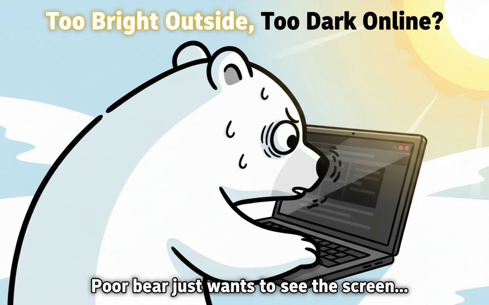
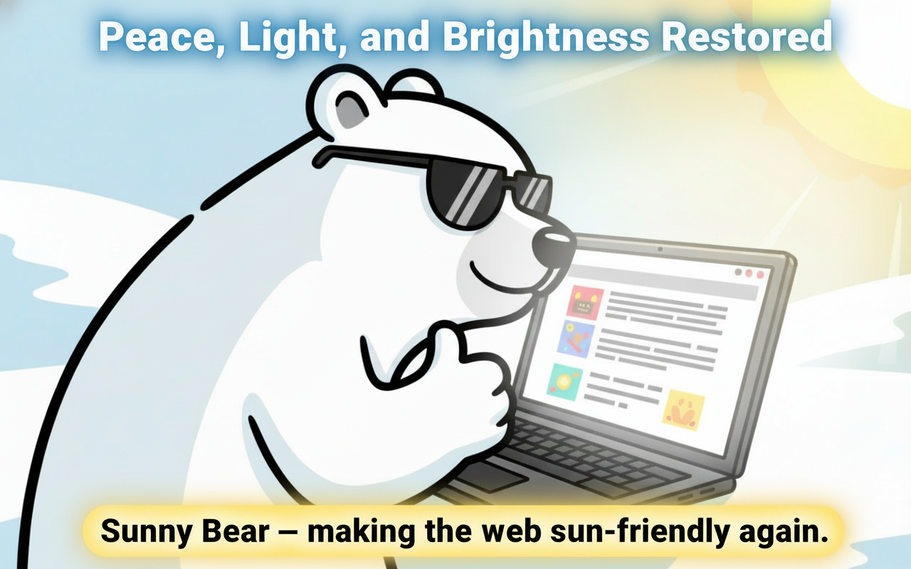

## 🐻☀️ Sunny Bear

Make dark-theme pages sunny and bright. One click flips gloomy sites into a gentle light theme that’s easier to read outdoors or in bright rooms.

- **One purpose**: turn dark pages light so they’re comfy under the sun
- **One click**: click the toolbar bear to toggle for the current site
- **Set-and-forget**: Sunny Bear remembers sites you’ve enabled

### How it works

Sunny Bear applies a safe, reversible light filter to pages and background images, and keeps watching for dynamic content so it stays bright as you scroll.

### Quick start

1. Install from the Chrome Web Store: `https://chromewebstore.google.com/detail/sunny-bear/jdjdmghffibmbnnhidfhdjegkcemmanb`
2. Visit any dark-theme site
3. Click the Sunny Bear icon to make it light. Click again to restore

### Manage sites

- Right-click the extension and open `Options` to view/edit your saved site list
- Import/export your list as JSON

### Permissions

- `activeTab`, `scripting`, `tabs`, `webNavigation`, and `storage` are used to apply the light style on the current site, track navigation, and remember your choices

### Support

If a page looks odd, just click again to turn it off for that site. You can also remove it from the list in Options.

Happy sunny browsing! 🌞
