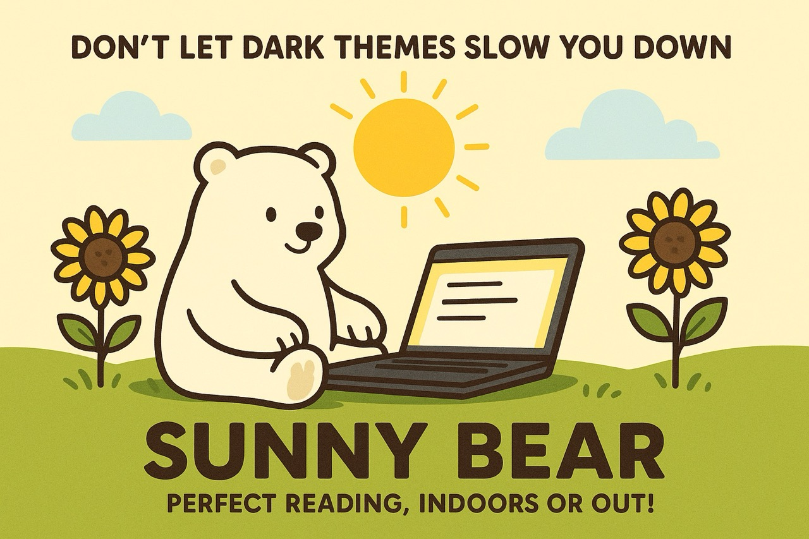

# 🐻‍❄️☀️ Sunny Bear

Turn every dark forest (website) into a sunlit picnic spot!
Sunny Bear is the adorable Chrome extension that transforms gloomy, dark-themed websites into bright, cheerful pages—perfect for sunny days, happy eyes, and curious bears everywhere.

---

## 🌞 What is Sunny Bear?

Is your favorite website so dark that even a polar bear can’t find their honey?
**Sunny Bear** flips the switch and bathes every site in glorious sunlight, so you’ll never squint at midnight-black backgrounds again.

---

## 🐻‍❄️ Features

- **Sunshine Mode:** Instantly brighten up any dark-themed website with a single click.
- **Bear-Memory:** Remembers which sites you want to keep sunny and which ones you like a little “night mode.”
- **Per-Site Toggle:** One bear’s sunshine is another’s shade—toggle light/dark per site, no problem!
- **Super Simple:** Even a sleepy bear could use it. Just click the Sunny Bear icon!
- **No Honey Required:** 100% free. No signups, no tracking—just good vibes.

---

## 🌈 How to Use

1. **Install Sunny Bear** from the [Chrome Web Store](https://chromewebstore.google.com/detail/light-theme/jdjdmghffibmbnnhidfhdjegkcemmanb).
2. When you stumble onto a dark, gloomy website, click the **☀️🐻‍❄️ Sunny Bear** icon in your toolbar.
3. Ta-da! The page is now bear-approved bright and shiny.
4. Click again to turn off. Sunny Bear will remember your choice.

---

## 🎒 Why Sunny Bear?

- Bright pages for bright ideas.
- Easy on the eyes, fun for the soul.
- Because every bear deserves a little sunshine.

---

## 🛠️ For Curious Cubs (Developers)

- Built with vanilla JavaScript, love, and a splash of bear magic.
- Per-site storage using Chrome’s bear-friendly API.
- Open source, MIT-licensed.
  Pull requests, bug reports, and bear puns welcome!

---

## 🍯 FAQ

**Q: Will Sunny Bear eat my cookies?**
A: No, but if you leave honey on your keyboard, we make no promises.

**Q: Can I have rainbow backgrounds instead?**
A: For that, check out Rainbow Bear!
